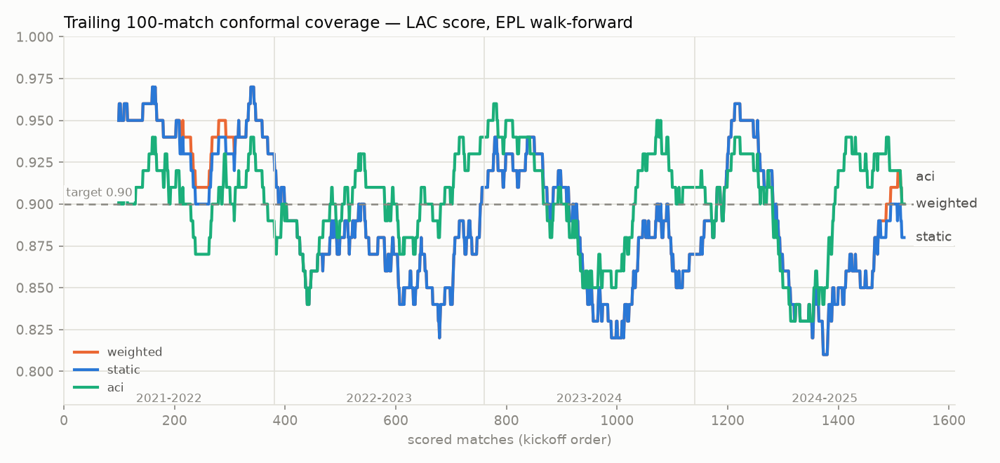
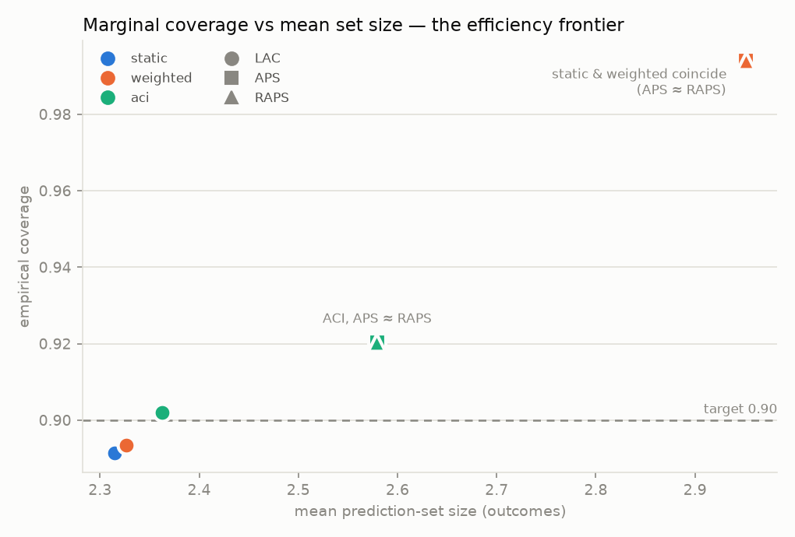
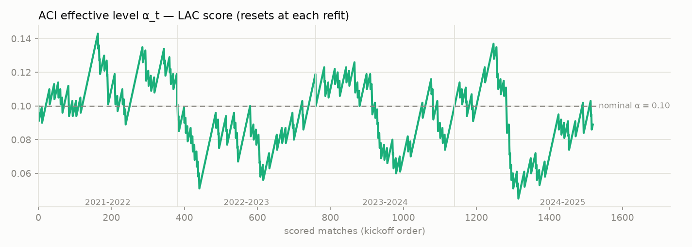

# Conformal prediction under temporal drift — EPL, real data

Same data and walk-forward protocol as docs/backtest_epl.md (football-data.co.uk, 4 expanding-window folds, 1520 scored matches), which measured the production static wrapper at 0.888 coverage vs the 0.90 target. This study crosses three conformal score functions with three adaptation strategies to ask: can the guarantee be restored under drift, and at what set-size price?

| axis | variants |
|---|---|
| score function | LAC (1−p̂, prod baseline) · APS (Romano et al. 2020) · RAPS (Angelopoulos et al. 2021, λ=0.1, k_reg=1) |
| adaptation | static split · weighted decay (Barber et al. 2023, half-life 250 matches) · ACI (Gibbs & Candès 2021, γ=0.01) |

ACI consumes settled results after full-time — the same feedback loop `/reflect` already runs in Phase B — and resets each fold because the model refits.

## The grid

|                      |   coverage |   mean set size |   % singleton |   worst 100-window |
|:---------------------|-----------:|----------------:|--------------:|-------------------:|
| ('static', 'lac')    |      0.891 |           2.314 |         0.127 |               0.81 |
| ('static', 'aps')    |      0.994 |           2.951 |         0     |               0.98 |
| ('static', 'raps')   |      0.994 |           2.951 |         0     |               0.98 |
| ('weighted', 'lac')  |      0.893 |           2.326 |         0.122 |               0.81 |
| ('weighted', 'aps')  |      0.994 |           2.951 |         0     |               0.98 |
| ('weighted', 'raps') |      0.994 |           2.951 |         0     |               0.98 |
| ('aci', 'lac')       |      0.902 |           2.362 |         0.126 |               0.83 |
| ('aci', 'aps')       |      0.92  |           2.58  |         0.001 |               0.86 |
| ('aci', 'raps')      |      0.92  |           2.579 |         0     |               0.86 |

Static split conformal reproduces the documented undercoverage (0.891 vs 0.90). Closest to nominal: **aci/LAC** at 0.902 with mean set size 2.36.

Weighted decay tracks static almost exactly here (orange is drawn under blue and peeks out where they differ): the expanding train's last-30% calibration slice is already recent, so a 250-match half-life barely reweights it — the interesting failure is *between* refits, which is exactly where ACI acts.

ACI's worst trailing window (0.830) beats static's (0.810) — the online correction repairs exactly the sagging stretches the marginal average hides.

## Coverage by season (LAC score)

|           |   static |   weighted |   aci |
|:----------|---------:|-----------:|------:|
| 2021-2022 |    0.937 |      0.939 | 0.905 |
| 2022-2023 |    0.871 |      0.871 | 0.905 |
| 2023-2024 |    0.879 |      0.879 | 0.9   |
| 2024-2025 |    0.879 |      0.884 | 0.897 |

## Conditional coverage by market favorite strength (LAC score)

| bin       |   static |   weighted |   aci |   n |
|:----------|---------:|-----------:|------:|----:|
| toss-up   |    0.947 |      0.949 | 0.96  | 452 |
| mild fav  |    0.89  |      0.89  | 0.907 | 365 |
| clear fav |    0.853 |      0.856 | 0.861 | 416 |
| heavy fav |    0.861 |      0.864 | 0.864 | 287 |

Marginal coverage says nothing per-slice. On this data the static wrapper's deficit concentrates in **clear fav** matches (0.853) while toss-up matches overcover (0.947) — slice-level honesty the marginal number hides, and the slice the suggestion layer's risk gate actually operates on.

## The conformal risk gate on flagged bets

|              |   n_capped |   roi_capped |   n_uncapped |   roi_uncapped |
|:-------------|-----------:|-------------:|-------------:|---------------:|
| static/lac   |        195 |       -0.202 |         1600 |          0.004 |
| weighted/lac |        192 |       -0.189 |         1603 |          0.002 |
| aci/lac      |        168 |       -0.253 |         1627 |          0.006 |

Flagging is pure EV, so the bet list is identical across variants — only which flagged bets the set caps to tier "low" changes. A useful uncertainty set concentrates the losses in the capped bucket (capped ROI below uncapped).

## Honest notes

- APS/RAPS are the deterministic (non-randomized) variants — mildly conservative by construction.
- Knobs not tuned: half-life (250) and γ (0.01) are literature-typical defaults, not swept; a sweep belongs in a follow-up, on a split that never touches these test seasons.
- ACI's guarantee is asymptotic long-run coverage; within one fold it can transiently over/under-cover while α_t settles.

## References

- Gibbs & Candès 2021 — *Adaptive Conformal Inference Under Distribution Shift* (NeurIPS).
- Barber, Candès, Ramdas & Tibshirani 2023 — *Conformal prediction beyond exchangeability* (Ann. Statist.).
- Romano, Sesia & Candès 2020 — *Classification with Valid and Adaptive Coverage* (NeurIPS).
- Angelopoulos, Bates, Malik & Jordan 2021 — *Uncertainty Sets for Image Classifiers using Conformal Prediction* (ICLR).
- Angelopoulos & Bates 2023 — *Conformal Prediction: A Gentle Introduction* (FnTML).
